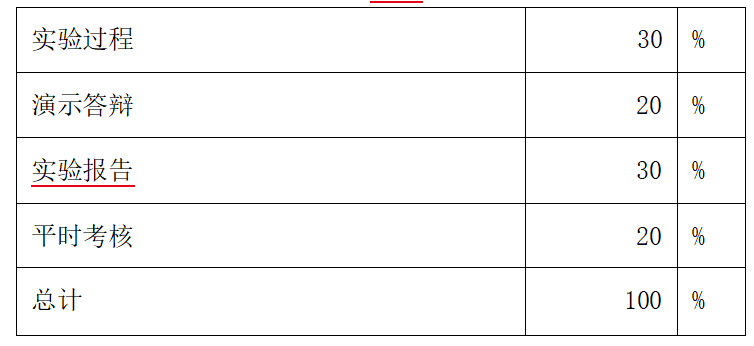

{width="5.761805555555555in"
height="2.64375in"}

1.  下载最新版本的DevEco Studio

2.  创建项目使用SDK26或以上版本

3.  尽可能多的使用鸿蒙新能力：https://developer.huawei.com/consumer/cn/features/

    {width="5.7652777777777775in"
    height="2.6430555555555557in"}

4.  最多五人一组，题目自拟

5.  最后一天线下答辩，小组中每个成员展示自己开发的内容，不允许小组某位成员只做文档

> 【25-26-2】"移动软件开发"结课考核内容及要求

"移动软件开发"结课考核包含现场答辩和提交考核材料两部分内容。现场答辩环节按照课上的要求进行；提交考核材料环节的内容及具体要求如下：

> 一、提交内容

1.  项目源代码

2.  课设报告

3.  答辩 PPT

# 二、提交方式及时间要求 

1.  提交内容存储要求：按照文件存放模板（详见附件【提交模板-"移动软件开发"结课考核-组别-姓名-姓名.zip】）和后续分项要求存放提交内容，压缩后命名为【"移动软件开发"结课考核-组别-姓名-姓名】。

2.  提交方式：以邮件形式提交，发送到王岚老师邮箱
    715230089@qq.com，并抄送贺老师it@bjut.edu.cn

3.  提交截止时间：2026 年 7 月 17 日（星期五）18:00 前。

# 三、提交内容要求 

1.  项目源代码

> ⑴提交内容要求：源程序（sql文件（
> 可选），后端源代码（可选），鸿蒙源代码）。
>
> ⑵存放位置：按照文件存放模板存放到【"移动软件开发"结课考核\--组别-姓名-姓名】文件夹下的【源代码】文件夹中。

2.  课设报告

> ⑴按照"移动软件开发"课设报告模板撰写课设报告。
>
> ⑵课设报告中每项内容（标题、正文、图表等）按照模板规定的格式要求撰写。
>
> ⑶课设报告正文总字数控制在 3000 字以内。
>
> ⑷命名要求："移动软件开发"课设报告-组别-姓名-姓名，例如："移动软件开发"课设报告-TEAM00-张三-李四。
>
> ⑸存放位置：按照文件存放模板存放到【"移动软件开发"结课考核\--组
>
> 别-姓名-姓名】文件夹下。

3.答辩 PPT

> ⑴答辩 PPT 首页自行设计，须包含以下内容：
>
> 学期：2025-2026学年第二学期；
>
> 课程名称：移动软件开发
>
> 组别：
>
> 学号：
>
> 姓名：

⑵命名要求："移动软件开发"结课考核答辩 PPT-组别-学号姓名，例

> 如："移动软件开发"结课考核答辩 PPT\--TEAM001-23080100 张三。
>
> ⑶存放位置：按照文件存放模板存放到【"移动软件开发"结课考核\--组
>
> 别-姓名-姓名】文件夹下。
