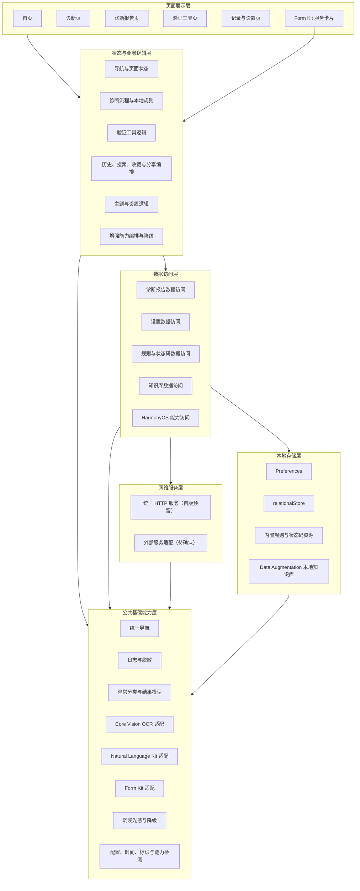
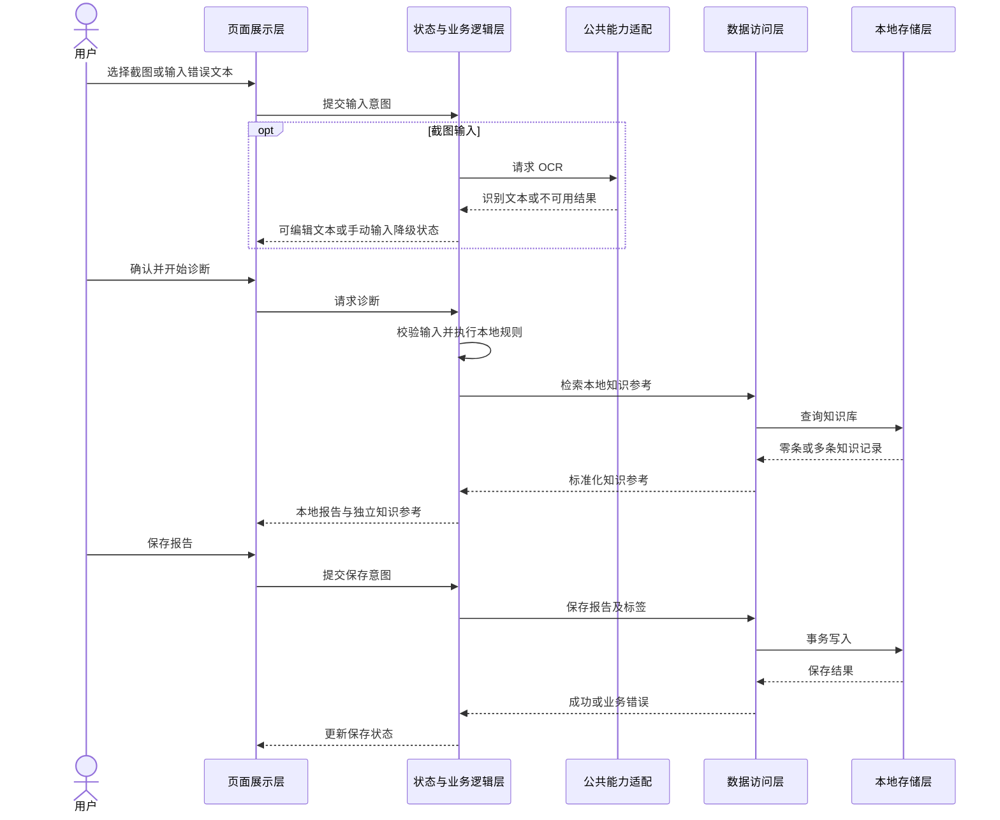
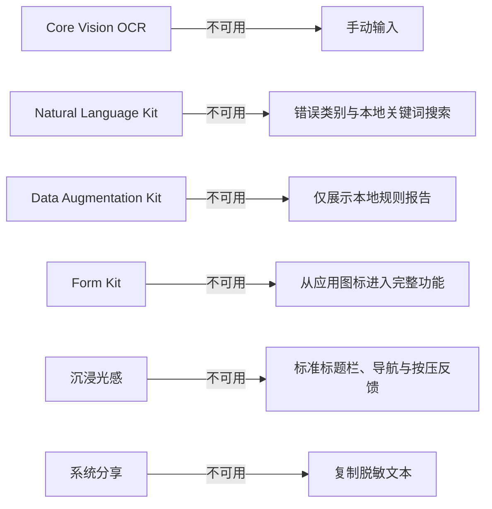

# 开发报错诊断助手概要设计说明书

> 文档版本：V1.0 草案
>
> 编写日期：2026-07-12
>
> 需求来源：`docs/development/需求规格说明书.md`
>
> 适用范围：课程项目第一版（P0 + P1）
>
> 技术基线：HarmonyOS 7（API 26）、ArkTS、ArkUI
>
> 文档说明：本文只描述系统级技术方案、模块边界和数据流，不涉及具体类、函数及代码实现。

## 1. 设计目标

### 1.1 系统核心目标

开发报错诊断助手面向学生开发者和初级软件开发者，提供离线优先、结果可解释、失败可降级的 HarmonyOS 报错诊断能力。系统需要实现以下核心目标：

1. 支持用户选择单张报错截图，通过 Core Vision OCR 提取文字，并允许用户在诊断前检查和编辑识别结果。
2. 支持用户直接输入或粘贴错误日志，在 OCR 不可用时仍可完成全部核心诊断流程。
3. 使用本地诊断规则识别 JSON、HTTP、网络、权限、空值、ArkTS、Hvigor、OHPM 等常见错误，输出包含证据、可能原因、排查步骤和风险提示的结构化报告。
4. 提供 JSON 验证、HTTP 状态码解释、URL 编解码、Base64 编解码和正则表达式测试等辅助工具。
5. 在本地保存用户主动确认的诊断报告，支持查看、搜索、筛选、收藏、删除、清空和分享前脱敏检查。
6. 集成 Form Kit、Natural Language Kit、Data Augmentation Kit 和沉浸光感等 HarmonyOS 能力，并保证增强能力不可用时核心流程仍可使用。
7. 支持手机和平板基础适配、深色模式和必要的无障碍能力，确保应用在课程指定环境中稳定运行和重复演示。

系统的核心业务闭环为：

```text
输入截图或错误文本
→ 获得并确认可编辑文本
→ 执行本地规则诊断
→ 检索本地知识库参考
→ 展示结构化诊断报告
→ 使用辅助工具验证
→ 保存、检索和复用历史报告
```

### 1.2 概要设计要解决的问题

概要设计需要在需求规格与后续详细设计之间建立稳定边界，重点解决以下问题：

- 明确页面、业务状态、诊断规则、数据访问、本地存储、网络服务和系统能力之间的职责边界，避免页面直接承担诊断、数据库或系统能力调用。
- 规定层间依赖方向和数据传递方式，防止循环依赖及跨层访问。
- 为 OCR、Natural Language Kit、Data Augmentation Kit、Form Kit 和沉浸光感建立可替换、可降级的能力边界。
- 区分临时诊断会话、已保存报告、应用设置、文本标签和只读知识数据的生命周期与存储方式。
- 统一导航、状态、日志、异常和异步任务的处理原则，避免返回后状态丢失、重复提交、无限加载和异常扩散。
- 为未来接入外部 AI、云同步或其他规则包保留扩展位置，同时不让尚未确认的能力增加第一版核心流程的复杂度。
- 建立与需求验收标准一致的测试边界，使核心规则、数据存储、系统能力降级和主要页面流程能够分别验证。

### 1.3 第一版设计范围

第一版最低交付范围为需求中全部 P0 和全部 P1 功能。

#### 1.3.1 P0 核心范围

- 首页及五个主要页面组的导航与返回；
- 单张图片选择、Core Vision OCR 和手动输入降级；
- 错误文本输入、编辑、校验和会话内保留；
- 本地错误分类、通用错误兜底和结构化诊断报告；
- JSON 验证和 HTTP 状态码解释；
- 报告保存、查看、单条删除和清空；
- 主题设置及其持久化；
- 空状态、加载状态、错误状态和权限不足状态；
- 断网可用、手机和平板基础适配。

#### 1.3.2 P1 增强范围

- 历史记录搜索、分类筛选、收藏和收藏优先展示；
- 报告复制、系统分享、分享预览及敏感信息提示；
- URL 编解码、Base64 编解码和正则表达式测试；
- Form Kit 桌面服务卡片；
- Natural Language Kit 辅助标签、搜索和隐私提示；
- Data Augmentation Kit 本地错误知识库；
- 沉浸光感核心交互视觉增强及标准样式降级。

Data Augmentation Kit 在本概要设计中统一按 P1 管理。需求规格说明书中仍将其标为 P2 的位置应后续同步修订，但不影响本设计采用的范围基线。

#### 1.3.3 第一版范围之外

- 用户账号、角色权限、付费和广告；
- 后端服务器、云端数据库和跨设备同步；
- GitHub、Gitee 或其他代码仓库的直接读写；
- 自动执行日志中的命令、远程编译和自动修改用户代码；
- 外部大模型补充诊断；
- 用户自定义诊断规则和批量截图诊断。

上述能力如进入后续版本，应先完成需求变更和独立设计，不在第一版中保留不可操作的空入口。

### 1.4 设计原则

#### 1.4.1 离线优先

P0 和 P1 的核心诊断、验证工具、历史记录和设置不依赖外部网络。网络服务失败或完全不可用时，用户仍能完成核心闭环。

#### 1.4.2 单向依赖

高层业务规则不依赖具体页面、数据库或系统能力实现。页面通过状态与业务逻辑层发出操作，数据访问层负责选择数据来源，底层结果再向上转换为页面状态。

#### 1.4.3 模块解耦

诊断、工具、历史、设置和 HarmonyOS 增强能力具有明确边界。OCR、自然语言处理、知识库和服务卡片通过独立能力接口接入，禁止系统能力调用散落在多个页面中。

#### 1.4.4 稳定核心、增强可降级

本地文本诊断是始终可用的核心路径。Core Vision OCR、Form Kit、Natural Language Kit、Data Augmentation Kit 和沉浸光感均不得成为核心业务的唯一入口；初始化或调用失败时必须回退到标准功能。

#### 1.4.5 单一数据来源

每类数据只能由一个明确模块负责维护。诊断会话由诊断状态模块维护，已保存报告由历史数据仓库维护，主题等设置由设置数据仓库维护，页面不得保存相互冲突的副本。

#### 1.4.6 易维护与易测试

本地诊断规则、HTTP 状态码资料、UI 文案和知识条目集中管理并带版本信息。业务规则应能脱离页面进行测试，数据访问和系统能力应能在测试中替换为受控实现。

#### 1.4.7 易扩展但不过度设计

第一版采用单 HAP 的模块化单体结构，不因未来可能出现的需求提前拆分 HAR、HSP 或远程服务。后续只有在复用、独立发布或团队并行开发需求明确时再进行工程级拆分。

#### 1.4.8 隐私与最小权限

系统只读取用户主动选择的图片，不保存原始截图，不执行日志内容，不在日志中记录完整诊断文本、Token、密码或内部地址。权限在用户触发对应功能时按需申请。

## 2. 技术选型

### 2.1 HarmonyOS 开发模式

| 项目 | 选型 | 选择原因 |
| --- | --- | --- |
| 应用模型 | Stage 模型 | Stage 模型是当前 HarmonyOS 应用开发的主要模型，适合管理 UIAbility 生命周期、页面启动和服务卡片拉起场景。 |
| 工程形态 | 单 HAP、模块化单体 | 当前主要由个人开发，单 HAP 可以降低构建、签名和模块通信复杂度；通过内部清晰分层保持可维护性。 |
| 开发工具 | 最新稳定版 DevEco Studio | 满足课程要求，并与 API 26 SDK、模拟器、调试和测试工具保持一致。具体 DevEco Studio 构建版本待创建工程后记录。 |
| 设备范围 | 手机为主要目标，兼顾平板 | 对应课程的鸿蒙移动应用要求，同时满足需求中的手机和平板基础适配。 |

暂不拆分 HAR 或 HSP。若后续出现跨 HAP 复用、独立发布或明显的构建隔离需求，再单独评估模块拆分。

### 2.2 ArkTS 与 ArkUI

项目使用 ArkTS 作为业务和界面开发语言，使用 ArkUI 声明式 UI 构建页面。

选择原因：

- 符合课程指定的 ArkTS 开发要求；
- ArkTS 的静态类型和编译期检查有助于降低诊断数据结构、异步状态和页面参数的运行时错误；
- ArkUI 的声明式开发方式适合由状态驱动空闲、加载、成功、失败和降级等多种页面状态；
- ArkUI 支持响应式布局、主题适配、无障碍属性和多设备界面适配；
- 与 Core Vision、Form Kit、Natural Language Kit、Data Augmentation Kit 等系统能力的 ArkTS 接口保持统一技术栈。

### 2.3 API Version

推荐以 HarmonyOS 7（API 26）作为第一版的编译、目标和主要验证基线。

选择原因：

- 满足课程“SDK/API 26 或以上”的硬性要求；
- API 26 是 HarmonyOS 7 新能力的目标版本，适合验证沉浸光感和 AI 相关开放能力；
- 统一使用 API 26 可以减少开发环境、模拟器和答辩设备之间的差异。

工程创建时应记录实际的 `compileSdkVersion`、`compatibleSdkVersion`、`targetSdkVersion` 和 SDK 补丁版本。各字段是否全部固定为 26，需要根据最新版 DevEco Studio 创建模板、课程演示设备和所有 P1 能力的最低版本要求确认，当前标记为**待确认**。如果课程设备只支持 API 26 的特定版本，应以可安装、可运行、可演示为最终选择标准。

### 2.4 页面路由方案

项目采用 ArkUI `Navigation` 作为统一页面路由和返回栈管理方案。

选择原因：

- 适合首页、诊断页、报告页、工具页、历史与设置页之间的多层跳转；
- 能统一处理系统返回、页面参数、返回来源和导航栈恢复；
- 便于从诊断报告携带文本进入验证工具，并在返回时保留原报告；
- 便于处理 Form Kit 服务卡片拉起应用后跳转到截图诊断、文本诊断或历史记录等目标页面；
- 比分散的页面跳转调用更容易测试和维护。

路由层只传递页面定位所需的轻量参数或本地数据标识，不传递大段日志、图片内容或完整报告对象。报告详情优先根据会话状态或报告标识读取，避免导航参数成为第二份数据源。

服务卡片的具体拉起参数格式、目标页面恢复方式和冷启动行为需在 API 26 设备上验证，标记为**待确认**。

### 2.5 状态管理方案

推荐使用 ArkUI 状态管理 V2，并按状态作用域分为三类：

1. 页面局部状态：输入框内容、选中的工具页签、弹窗开关和当前加载提示等，只在单个页面或组件树中有效。
2. 业务会话状态：当前诊断输入、OCR 状态、未保存报告、工具返回来源和一次性操作结果，由对应业务状态模块维护。
3. 应用级状态：主题模式、增强能力可用性和必要的全局导航信息，由应用级状态容器维护。

选择原因：

- 状态管理 V2 适合新建 ArkUI 工程，能够通过明确的数据所有权驱动界面刷新；
- 有助于区分临时会话与持久化数据，避免把数据库内容复制为多个互相冲突的页面状态；
- 便于禁止 OCR、诊断、保存和删除等操作的重复提交；
- 可以在系统能力失败时将页面稳定切换到降级状态，而不是由异常直接控制 UI。

状态管理 V2 的具体装饰器组合以及与 API 26 工程模板的兼容情况，应以实际 SDK 文档和工程验证结果为准，标记为**待确认**。无论采用何种具体装饰器，均应保持单向状态更新和单一数据来源原则。

### 2.6 网络请求方案

项目保留独立网络服务层，计划使用 HarmonyOS 官方 HTTP 请求能力，并在其上建立统一的请求配置、超时、取消、错误转换和日志策略。

选择原因：

- 使用系统官方能力可以减少第三方依赖和适配风险；
- 统一封装能够避免页面直接发起请求，并为未来外部 AI 或云服务提供稳定边界；
- 便于统一实施超时、取消、有限重试和敏感信息保护。

第一版 P0 和 P1 均按离线可用设计，目前没有必须访问外部服务器的业务。Data Augmentation Kit 使用本地知识库，Natural Language Kit 的结果用于本地标签和隐私提示。因此第一版网络层不参与核心诊断流程，也不应为了保留扩展能力而申请不必要的网络权限。

以下内容均标记为**待确认**：

- 是否在后续版本启用外部 AI 或其他云服务；
- 服务提供方、基础地址、鉴权方式和证书策略；
- 各类请求的超时和最大重试次数；
- 用户授权、上传内容范围和脱敏规则；
- 是否需要网络缓存。

### 2.7 本地数据存储方案

根据数据规模、查询方式和生命周期，采用组合存储方案。

| 数据类型 | 推荐方案 | 选择原因 |
| --- | --- | --- |
| 主题、首次启动等少量设置 | Preferences | 数据量小、键值结构稳定，适合立即读写和应用重启恢复。 |
| 诊断报告、收藏状态、搜索标签 | relationalStore | 需要排序、筛选、搜索、数量限制、关联删除和事务一致性，关系型存储更适合持续增长的结构化记录。 |
| 诊断规则、HTTP 状态码资料 | 应用内置只读资源 | 内容随应用版本发布，普通用户不可修改，集中维护可避免散落在页面中。 |
| Data Augmentation Kit 知识条目 | 独立本地知识库资源及能力适配层 | 与用户历史隔离，支持按版本发布、检索和不可用时降级。 |
| 当前诊断输入和未保存报告 | 内存中的业务会话状态 | 默认不持久化，防止用户未确认的数据被长期保存。 |
| 原始截图 | 不持久化 | 满足隐私和需求约束，只在当前 OCR 会话中使用系统返回的临时访问地址。 |

存储设计遵循以下原则：

- 报告只在用户主动保存后写入持久化存储；
- 保存报告及其标签时保持一致性，删除报告时同步删除关联标签；
- 同一报告重复保存不能产生重复记录；
- 历史记录达到 200 条时优先淘汰最早且未收藏的记录；
- 收藏记录是否永久不参与自动淘汰，按当前需求暂定为“是”，最终标记为**待确认**；
- 历史全文搜索范围、索引方式和 Natural Language Kit 长文本处理上限标记为**待确认**；
- 数据表结构、字段约束、迁移版本和索引属于详细设计内容，不在本文展开。

### 2.8 日志和异常处理方案

#### 2.8.1 日志方案

公共基础能力层提供统一日志入口，底层使用 HarmonyOS HiLog。日志按调试、信息、警告和错误等级输出，并至少区分以下业务域：

- 应用启动与导航；
- OCR 和图片读取；
- 本地诊断与知识库检索；
- 验证工具；
- 历史记录与设置存储；
- Form Kit、Natural Language Kit、Data Augmentation Kit 和沉浸光感；
- 网络服务。

生产或答辩构建不得记录完整原始日志、原始截图、Token、密码、密钥、Authorization 内容或内部地址。日志只记录必要的操作标识、结果类型、耗时、能力可用状态和脱敏后的错误摘要。

#### 2.8.2 异常处理方案

异常分为输入校验错误、业务可预期错误、系统能力不可用、存储错误、网络错误和未知系统错误。底层异常必须先转换为稳定的业务错误，再由业务状态层决定页面展示内容。

处理原则如下：

- 输入错误在当前页面就近提示，不清空用户输入；
- OCR 失败、取消或超时后停止加载，并保留手动输入路径；
- 数据读取失败不删除已有数据，删除失败不提前从页面移除记录；
- 增强能力失败只关闭对应增强区域，不中断本地诊断报告；
- 异步操作无论成功或失败都必须进入结束状态；
- 网络请求必须支持超时和取消，只允许对明确可重试的失败进行有限重试；
- 未知异常显示可理解的通用提示，详细信息只写入脱敏日志；
- 页面销毁后，不再用过期异步结果更新页面状态。

### 2.9 测试方案

采用“业务单元测试 + 数据与能力集成测试 + 页面流程测试 + 设备验收”的分层测试策略。

| 测试层次 | 主要范围 | 推荐方式 |
| --- | --- | --- |
| 单元测试 | 输入校验、错误分类、规则优先级、报告生成、JSON/URL/Base64/正则处理、HTTP 状态码分类、脱敏规则 | DevEco Studio Local Test |
| 数据集成测试 | 报告保存、重复保存、收藏、标签关联、删除、清空、200 条淘汰、Preferences 设置恢复 | Instrument Test 或目标环境集成测试 |
| 能力适配测试 | Core Vision OCR、Natural Language Kit、Data Augmentation Kit、Form Kit 刷新与拉起、增强能力降级 | 模拟能力测试与 API 26 模拟器/真机验证相结合 |
| UI 流程测试 | 首页导航、截图/文本诊断、报告保存、工具返回、历史搜索、主题切换和错误状态 | DevEco Studio UI 测试或 Hypium 自动化测试 |
| 非功能测试 | 冷启动、长文本、连续诊断、断网、横竖屏、1.5 倍字体、深色模式和异常恢复 | 手工验收、自动化回归及 DevEco Testing |

测试优先覆盖需求规格说明书中的十三项 P0 验收标准，并为全部 P1 能力补充成功、不可用、失败和降级用例。最终至少在 API 26 手机模拟器和平板模拟器上完成回归；Core Vision OCR、Form Kit、Natural Language Kit、Data Augmentation Kit 和沉浸光感还应在支持 API 26 的真机或官方远程真机上逐项验证。

以下测试环境信息标记为**待确认**：

- 最终 DevEco Studio、SDK 和模拟器的完整版本号；
- 答辩使用的具体设备型号；
- API 26 远程真机的可用时间和型号；
- 各 P1 系统能力在模拟器上的支持范围；
- 自动化测试覆盖率目标。

## 3. 系统总体架构

### 3.1 架构风格

系统采用分层模块化单体架构。在单个 HAP 内按职责划分页面展示层、状态与业务逻辑层、数据访问层、网络服务层、本地存储层和公共基础能力层，并在各层内部按首页、诊断、报告、工具、历史、设置和增强能力组织功能。

该结构在个人开发场景下保持工程简单，同时能够隔离变化频繁的页面与系统能力，避免业务规则依赖具体 UI、数据库或网络实现。

### 3.2 总体分层



### 3.3 各层职责

#### 3.3.1 页面展示层

职责：

- 展示页面、服务卡片、表单、列表、报告和用户反馈；
- 将用户点击、输入、返回和确认等行为转换为业务意图；
- 根据状态与业务逻辑层提供的状态展示空闲、加载、成功、失败和降级界面；
- 负责响应式布局、主题、无障碍描述和沉浸光感的视觉呈现。

依赖关系：只依赖状态与业务逻辑层及公共导航、主题等展示相关能力，不直接访问数据库、HTTP、OCR、知识库或系统分享能力。

#### 3.3.2 状态与业务逻辑层

职责：

- 管理诊断会话、页面操作状态和应用级状态；
- 校验输入并编排 OCR、诊断、知识库检索、报告保存、验证工具和分享流程；
- 执行本地诊断规则和通用错误兜底；
- 控制异步任务的开始、成功、失败、取消和结束状态；
- 防止重复诊断、重复保存和重复删除；
- 根据能力检测结果选择标准路径或降级路径。

依赖关系：依赖数据访问层提供的数据操作抽象，并使用公共基础能力；不依赖具体页面和具体存储实现。

#### 3.3.3 数据访问层

职责：

- 为业务层提供统一的数据读取、写入、搜索和删除入口；
- 隔离 Preferences、relationalStore、内置资源、本地知识库和未来远程服务的差异；
- 维护保存报告与标签、删除报告与关联数据等一致性；
- 负责数据对象与存储对象之间的转换；
- 根据业务需要组合本地数据和增强能力结果，但不得改变本地诊断结论。

依赖关系：依赖本地存储层、网络服务层和公共能力适配，不依赖页面展示层。

#### 3.3.4 网络服务层

职责：

- 统一管理 HTTP 请求、超时、取消、有限重试和错误转换；
- 隔离未来外部 AI 或云服务的提供方差异；
- 负责网络请求的最小必要日志和敏感信息保护。

依赖关系：只能被数据访问层调用，不能由页面直接使用。第一版没有确定的联网业务，因此该层处于预留状态，不进入 P0/P1 核心链路。

#### 3.3.5 本地存储层

职责：

- 使用 Preferences 保存轻量设置；
- 使用 relationalStore 保存报告、收藏状态和搜索标签；
- 提供内置诊断规则、HTTP 状态码和 UI 基础文案；
- 提供 Data Augmentation Kit 使用的本地知识资源；
- 执行必要的事务、数据版本识别和存储错误上报。

依赖关系：由数据访问层统一访问，不向页面暴露具体存储结构。

#### 3.3.6 公共基础能力层

职责：

- 提供统一导航、日志、脱敏、错误分类、配置、时间和本地标识能力；
- 封装 Core Vision OCR、Natural Language Kit、Form Kit、沉浸光感及系统分享等平台能力；
- 检测设备和 API 能力，向上层返回标准化的可用、不可用和失败结果；
- 保证平台能力更换或降级时不改变核心业务层的调用语义。

依赖关系：作为基础设施被上层使用，但不反向依赖页面和具体业务流程。平台能力适配之间保持独立，禁止相互隐式调用。

### 3.4 依赖规则

系统依赖必须遵守以下规则：

1. 页面展示层只能向状态与业务逻辑层发出操作，不直接访问持久化或网络。
2. 状态与业务逻辑层通过数据访问抽象获取数据，不感知 relationalStore、Preferences 或 HTTP 的具体细节。
3. 数据访问层可以组合多个数据源，但不得包含页面展示逻辑。
4. 网络服务层和本地存储层互不依赖，二者只通过数据访问层进行协调。
5. 公共基础能力层不得持有具体页面状态，也不得反向调用页面。
6. P1 增强能力通过独立适配边界接入，禁用或失败后不得破坏 P0 本地诊断。
7. P2 外部 AI 如后续启用，只能作为本地报告之后的独立补充结果，不得覆盖本地诊断结论。

### 3.5 核心数据传递方向



数据从页面向下传递时表示用户意图，从底层向上返回时表示标准化结果或业务错误。底层不得直接修改页面；页面也不得持有与持久化数据相竞争的长期副本。

### 3.6 关键业务模块与架构映射

| 业务模块 | 主要所在层 | 协作层 |
| --- | --- | --- |
| 首页与功能导航 | 页面展示层、状态与业务逻辑层 | 数据访问层、统一导航 |
| 截图选择与 OCR | 状态与业务逻辑层、公共能力层 | 页面展示层 |
| 文本输入与本地诊断 | 状态与业务逻辑层 | 规则数据访问、公共错误模型 |
| 诊断报告 | 页面展示层、状态与业务逻辑层 | 报告数据访问、知识库数据访问 |
| JSON/HTTP/扩展工具 | 状态与业务逻辑层 | 页面展示层、公共日志 |
| 历史、搜索和收藏 | 状态与业务逻辑层、数据访问层 | relationalStore、Natural Language Kit |
| 分享与脱敏 | 状态与业务逻辑层、公共能力层 | Natural Language Kit、本地脱敏规则 |
| 主题与设置 | 状态与业务逻辑层、数据访问层 | Preferences、页面展示层 |
| Form Kit 服务卡片 | 页面展示层、公共能力层 | 报告数据访问、统一导航 |
| Data Augmentation 知识库 | 数据访问层、公共能力层 | 本地知识存储、诊断报告 |
| 沉浸光感 | 页面展示层、公共能力层 | 主题和能力检测 |

### 3.7 增强能力降级关系



所有增强能力都必须先检测设备与 API 支持情况，并将不可用视为可预期状态，而不是应用级故障。

### 3.8 主要待确认事项

概要设计保留以下待确认项，不在本阶段随意假设：

1. DevEco Studio、API 26 SDK、模拟器和答辩设备的完整版本号。
2. 工程中各 SDK 版本字段的最终取值及 API 26 补丁版本。
3. Core Vision OCR、Form Kit、Natural Language Kit、Data Augmentation Kit 和沉浸光感在目标模拟器及真机上的实际支持范围。
4. Form Kit 冷启动、页面拉起和刷新参数的具体约定。
5. 历史全文搜索范围、索引方式和 Natural Language Kit 长文本处理上限。
6. URL、Base64 和正则工具的最终输入长度限制。
7. 自动脱敏需要覆盖的具体规则及用户确认交互。
8. 收藏记录是否永久不参与 200 条历史上限的自动淘汰。
9. 是否恢复未保存的诊断草稿；第一版默认不恢复。
10. 是否在后续版本接入外部 AI，以及相关服务、费用、鉴权、隐私和网络策略。

## 4. 参考资料

- 项目需求规格说明书：`docs/development/需求规格说明书.md`
- HarmonyOS 开发者文档中心：<https://developer.huawei.com/consumer/cn/doc/>
- HarmonyOS 7（API 26）能力说明：<https://developer.huawei.com/consumer/cn/discover/>
- HarmonyOS 应用开发知识地图：<https://developer.huawei.com/consumer/cn/app/knowledge-map/>
- HarmonyOS 开发者测试服务：<https://developer.huawei.com/consumer/cn/testing/get-started/>
